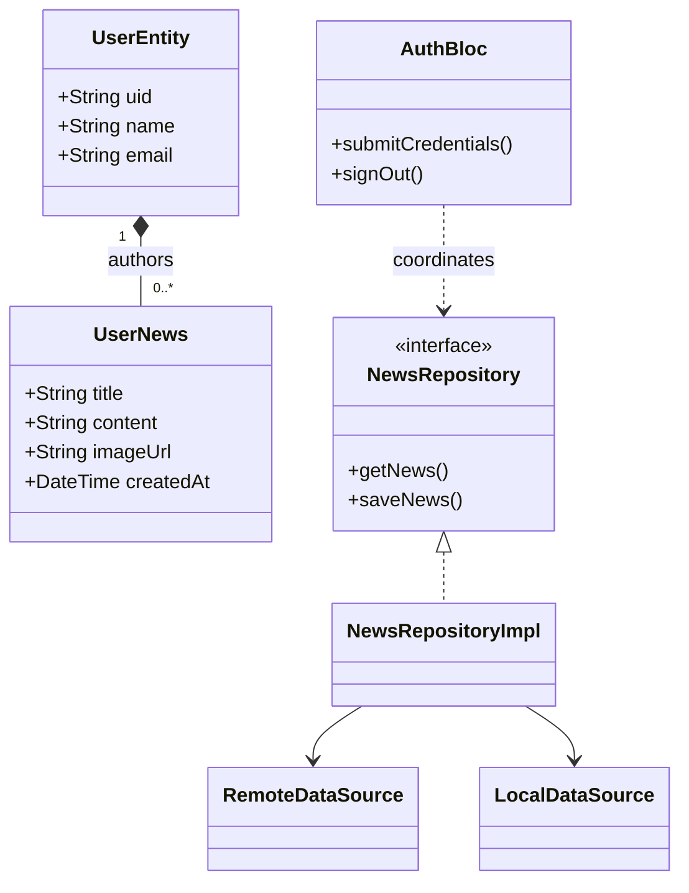
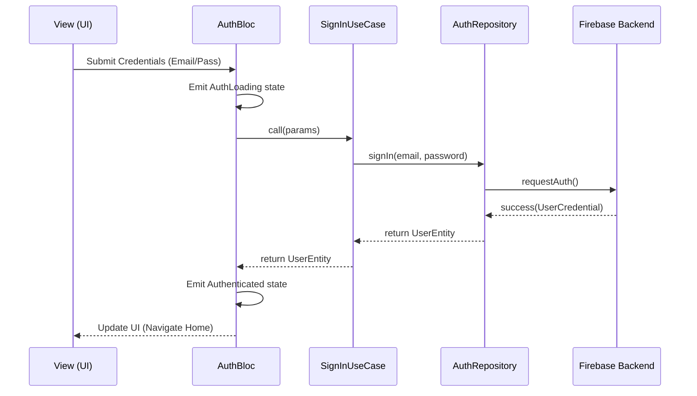
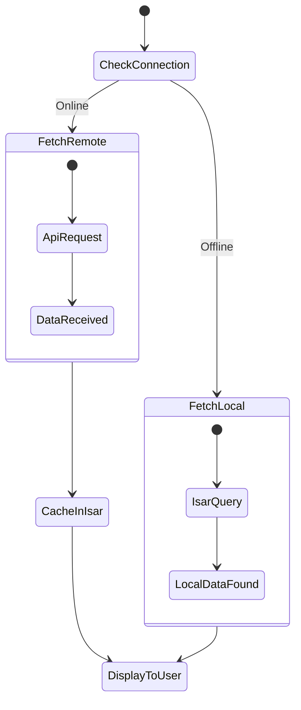

# Kabar News - Project Figures and Tables
### Supplementary Figures and Tables for the B.Tech internship report.

---

## 1. Figures

### Figure 1.1: Kabar Logo Design
The logo represents the modern, minimalist, and digital nature of the platform.


---

### Figure 3.1: Use Case Diagram
Describes user interactions with the Kabar system modules.

```mermaid
useCaseDiagram
    actor User
    User --> (SignUp / Login)
    User --> (Select Personalized Topics)
    User --> (Update Profile Details)
    User --> (Publish News Articles)
    User --> (Bookmark News for Offline)
```

---

### Figure 3.2: Class Diagram
Structural relationship between entities, repositories, and state management units.



---

### Figure 3.3: Sequence Diagram (Login Flow)
Step-by-step interaction between UI, BLoC, UseCases, and Firebase Backend.



---

### Figure 3.4: Activity Diagram (Offline Synchronization)
Logic flow for fetching news and managing the local Isar cache.



---

### Figure 3.5: Clean Architecture Layer Diagram
The project strictly follows the **Clean Architecture** patterns as shown below.

---

### Figure 6.1: Home Screen with Trending News
High-fidelity mockup of the "Kabar" home screen showing the topic-based categories and trending headlines carousel.


---

## 2. Tables

### Table 2.1: Hardware and Software Specifications
Summary of technical requirements for the Kabar application's development and deployment.

| Specification | Hardware Requirements | Software Requirements |
| :--- | :--- | :--- |
| **Minimum** | 2GB RAM, i5 Quad-Core | Android 5.0+, iOS 12.0+ |
| **Recommended** | 16GB RAM, i7 Processor | Flutter 3.7.2, Dart 3.x |
| **Infrastructure** | Android/iOS Device, Emulators | Firebase Auth, Isar, Cloudinary |
| **Memory Capacity** | 100MB free storage | Windows 10/11, macOS, Linux |

---

### Table 5.1: Summary of Test Results
Detailed matrix of primary feature testing and performance validation.

| Test ID | Feature Under Test | Test Scenario | Expected Outcome | Result |
| :--- | :--- | :--- | :--- | :--- |
| **TC-01** | **Auth Flow** | Valid email/password log-in | Access granted to home screen | **PASS** |
| **TC-02** | **Offline Mode** | Disable internet and view news | Display cached news from Isar | **PASS** |
| **TC-03** | **Bookmarking** | Click bookmark icon on article | Article persists in local store | **PASS** |
| **TC-04** | **Data Sync** | Create news while offline | Article syncs when online detected | **PASS** |
| **TC-05** | **Profile Update** | Upload profile image | Cloudinary URL saved in user doc | **PASS** |
| **TC-06** | **Search** | Query "Tech" in search bar | Display matching news results | **PASS** |

---

### Additional Notes for Submission
- **Figures:** All images should be printed in color.
- **Tables:** Should follow portrait orientation as per University guidelines.
- **Diagrams:** The Mermaid architecture diagram should be clearly legible.
